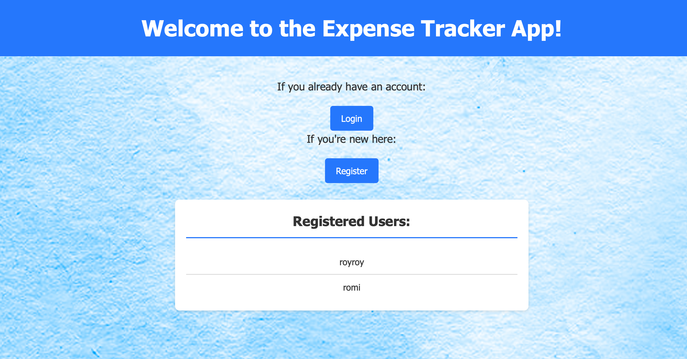
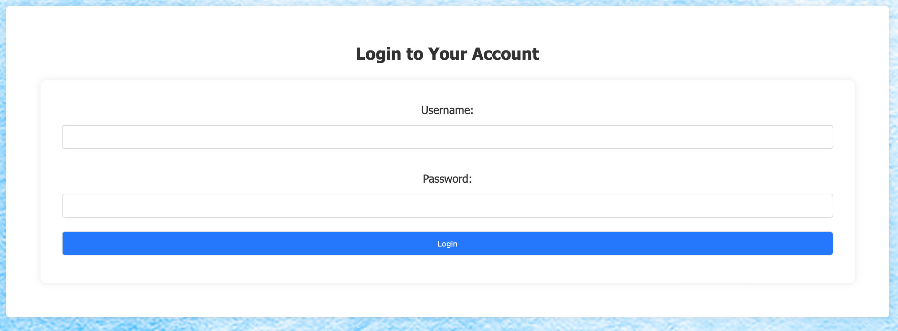
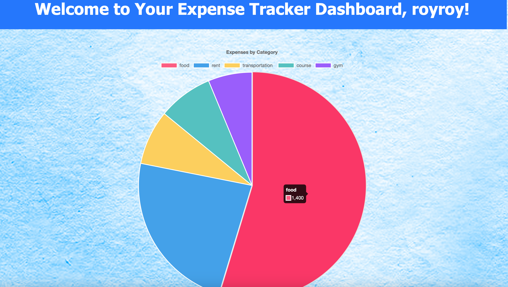

# Expenses Tracker

Welcome to the Expenses Tracker project! This application is designed to help users manage and visualize their expenses efficiently.

## Features
### Home

<div align="center"></div>

The home page greets you with a summary of your financial health, showing your recent transaction history and quick stats at a glance.

### Login

<div align="center"></div>

Secure access to your expense tracker with a robust login system. Manage your personal finances with confidence and privacy.

### Dashboard

<div align="center"></div>

The dashboard provides a quick overview of your expenses. It visualizes your spending patterns over time, helping you understand where your money goes.

### Add Expenses

<div align="center"></div>

Here you can add new expenses by entering details such as the expense category, amount spent, date of expense, and any additional notes.

### Current Expenses

<div align="center"></div>

This section allows you to view all your recorded expenses, edit them, or delete them. It's your financial activity log in one place.


## Technology Stack

Our project leverages a comprehensive set of technologies and tools to ensure high-quality development, continuous integration, and robust deployment practices. Below, you'll find a detailed overview of our tech stack, emphasizing our DevOps processes:

### Version Control

- **GitLab**: A single application for the entire software development lifecycle. From project planning and source code management to CI/CD, monitoring, and security.
  - <div align="center"></div>

### Continuous Integration and Delivery

- **Jenkins**: An open-source automation server that enables developers around the world to reliably build, test, and deploy their software. Jenkins orchestrates our CI/CD pipeline, integrating seamlessly with GitLab for a smooth development process.
  - <div align="center"></div>

### Containerization and Artifact Storage

- **Docker Hub**: A service provided by Docker for finding and sharing container images with your team. It's the world's largest library and community for container images. We use Docker Hub to store and manage our application's artifacts securely.
  - <div align="center"></div>

### Deployment

- **ArgoCD**: A declarative, GitOps continuous delivery tool for Kubernetes. ArgoCD automates the deployment of applications to various environments, ensuring that our production environment is always up to date with the latest stable version of our application.
  - <div align="center"></div>

### Monitoring

- **Grafana**: An open-source platform for monitoring and observability. Grafana allows us to query, visualize, alert on, and understand our metrics no matter where they are stored. It provides tools to turn our time-series database (TSDB) data into beautiful graphs and visualizations.
  - <div align="center"></div>

- **Prometheus**: An open-source systems monitoring and alerting toolkit. We use Prometheus alongside Grafana to monitor our applications and infrastructure at scale, providing insights into operational aspects.
  - <div align="center"></div>

### Database

- **MongoDB**: A general purpose, document-based, distributed database built for modern application developers and for the cloud era. MongoDB is our choice for storing and managing data due to its flexibility and scalability.
  - <div align="center"></div>

### Application Development

- **Python**: A programming language that lets us work quickly and integrate systems more effectively. Our application is written in Python, emphasizing clean code and maintainability.
  - <div align="center"></div>

Each technology and tool has been selected with care to support our development workflow, ensuring efficiency, reliability, and scalability of our application. Our DevOps practices encompass the entire application lifecycle, from development to deployment, monitoring, and updates, facilitating a culture of continuous improvement.


## Ready Project Setup with Docker

This guide details how to set up and run the `Ready` project locally using Docker, including a MongoDB database.

### Prerequisites:

- [Docker](https://www.docker.com/get-started) installed on your machine.
- Docker Compose (usually included with Docker Desktop).

### Setting Up Your Environment:


## Docker Setup

Ensure you have a `docker-compose.yml` file in the root of your project with the following content (modify as needed for your project):

```yaml
version: '3.8'
services:
  app:
    image: roytzahor/expese-tracker:latest
    ports:
      - "5000:5000"
    environment:
      - MONGO_URI=mongodb://mongo:27017/expenses_tracker_db
    depends_on:
      - mongo
  mongo:
    image: mongo:latest
    ports:
      - "27017:27017"
    volumes:
      - mongo_data:/data/db
volumes:
  mongo_data:
```

## Start the Application
With Docker and Docker Compose installed, and your docker-compose.yml ready, run the following command from the root directory of your project:

```bash
docker-compose up
```
This command downloads the necessary Docker images (if not already downloaded), creates the containers as defined in docker-compose.yml, and starts the services. The first time you run this command, it might take some time to download the images.

### Access:

The application will be accessible in your web browser at http://localhost:5000.

### Contributing:

We encourage contributions! Fork the repository, make your changes, and create a pull request.


## Contact:

For questions or feedback, feel free to reach out to us: [roy.tzahor1@gmail.com]

